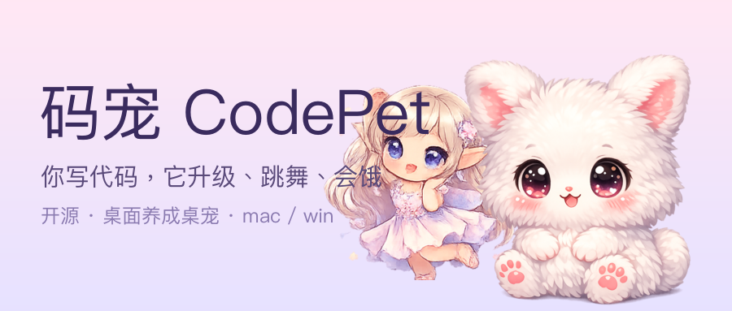
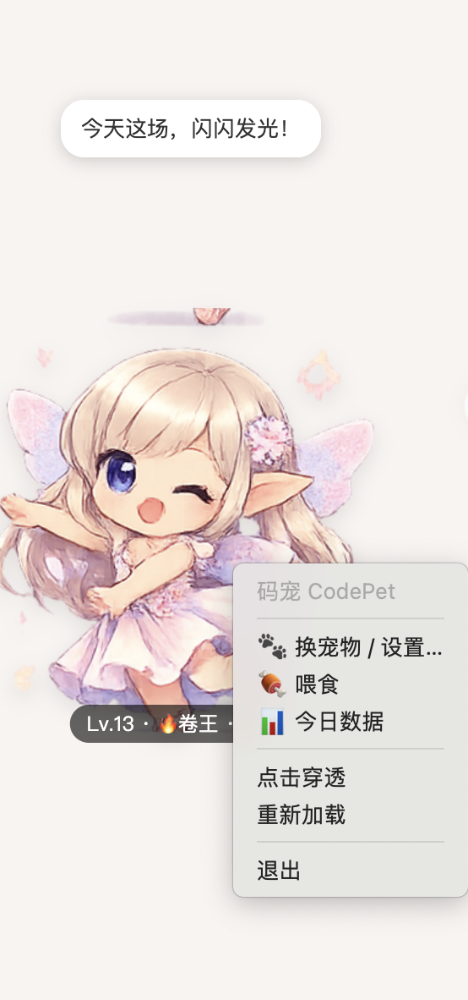
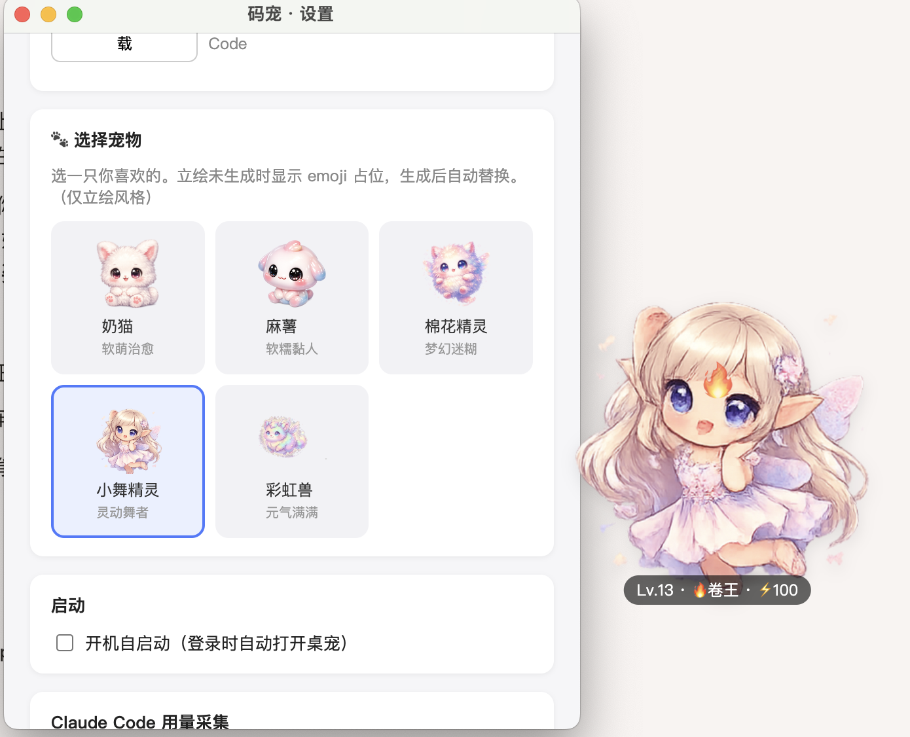
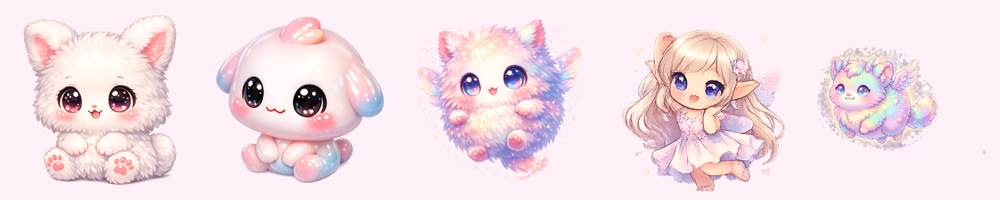

<div align="center">



# 码宠 CodePet 🐾

**你写代码、用 Claude Code，它就涨经验、升级、跳舞、冒话。**
数据只读本机 git 与 `~/.claude` 用量，**全本地 · 绝不外传 · 可一键关闭**。

[](LICENSE)


[](https://github.com/jnMetaCode/codepet)

中文 · 开源 · 由「AI不止语」社群共建


<table>
<tr>
<td></td>
<td></td>
<td></td>
</tr>
</table>

<i>会跳舞的小舞精灵 · 右键换宠物/喂食/数据 · 9 只原创宠物可选</i>



</div>

---

## 🐾 这是什么

把"干活"变成养成游戏。你每提交一次代码、每和 Claude Code 完成一个任务，桌宠都会**当场**抬头、蹦跶、涨经验。一天卷下来，它从摸鱼 😴 一路进化到卷王 🔥；好几天不写，它能量见底会"饿"。

它不是又一个 AI 聊天桌宠，而是**第一个把"桌面常驻可爱形象 + Claude Code 用量驱动养成 + 中文性格"三者合一**的开发者桌宠。

## ✨ 为什么和别的不一样

同类项目要么是终端里的 ASCII 宠物，要么是只看键鼠活动的桌面宠物，要么是 Live2D 却没接编程活动。码宠的差异点在三者交集：

- 🎨 **精致 2D 形象 + 程序化生命感**：呼吸、摇摆、眨眼、踩影子、时不时自己蹦一下——不是死图。
- ⚡ **深绑 Claude Code 用量**：通过官方 hooks **实时**感知你的提问/完成/工具调用，桌宠即时反应。
- 🀄 **中文性格**：9 只宠物各有人设（软萌奶猫、软糯麻薯、灵动小舞精灵、解谜搭子小黄鸭、古风白衣剑仙、元气少女…），台词接地气。

## 🔒 隐私（这是我们的底线，也是卖点）

- **全本地**：所有数据存在你本机，**绝不联网外传**。
- **只读聚合元数据**：提交数、增删行数、prompt/任务/工具的**次数**——**从不读取你的对话正文或代码内容**。
- **完全 opt-in**：Claude Code 联动、用量采集默认可关，由你主动开启。
- **开源可查**：代码全公开，隐私承诺可逐行验证。

> 设计对齐 Anthropic 官方社区对开发者宠物的隐私期待（claude-code #59081）。

## 📦 安装（推荐：直接装客户端）

不用配环境，去 **[Releases](https://github.com/jnMetaCode/codepet/releases)** 下载对应安装包，装上即用：

| 系统 | 下载 |
|---|---|
| **macOS · Apple 芯片**（M1/M2/M3/M4） | `CodePet-x.x.x-arm64.dmg` |
| **macOS · Intel 芯片** | `CodePet-x.x.x.dmg` |
| **Windows 10/11 (64 位)** | `CodePet Setup x.x.x.exe` |

- **macOS**：打开 `.dmg` → 把 CodePet 拖进「应用程序」→ 首次打开**右键图标→「打开」**（绕过未签名拦截）。  
  还不行就终端跑：`xattr -dr com.apple.quarantine /Applications/CodePet.app`
- **Windows**：双击 `.exe` → SmartScreen 提示点「**更多信息 → 仍要运行**」→ 按引导安装。

> 安装包**未做代码签名**，所以首次打开会有安全提示，正常现象。介意的话可自行用 Apple Developer ID / Windows 代码签名证书签名后分发。

## 🛠 从源码运行（开发模式）

需要 Node 18+。

```bash
cd codepet
npm install
npm start
```

桌宠出现在屏幕右下角。**托盘菜单**有：今日数据 / 喂食 / 设置 / 点击穿透 / 退出。

## 🎨 选你的宠物

设置窗 →「🐾 选择宠物」，9 只任选，点一下即热切换（九宫格）：

🐱 奶猫(软萌治愈) · 🍡 麻薯(软糯黏人) · 🧚 棉花精灵(梦幻迷糊)
💃 小舞精灵(灵动舞者) · 🌈 彩虹兽(元气满满) · 🦆 小黄鸭(解谜搭子)
🗡️ 白衣剑仙(古风剑舞) · 🎀 元气少女(活力满分) · 💃 程序媛·舞(真人摇摆)

立绘未生成时显示 emoji 占位（也会动）。生成原创立绘：

```bash
# 1) 用你自己的 OpenAI key（用完记得吊销轮换；key 只留在本机环境变量，绝不写进代码）
export OPENAI_API_KEY=sk-你的key
# 2) 生成（gpt-image-1，透明背景原创小动物）
node tools/gen-character.js list      # 看有哪些宠物
node tools/gen-character.js all       # 每只各出 1 张，做选择画廊
node tools/gen-character.js cat all   # 出「猫」的 4 个表情
```

图落在 `src/renderer/assets/<宠物>/`，设置里选中即用。

## 🖼 自定义你自己的宠物（上传图片，零代码）

不想写代码、也不用 API key——设置窗 →「✨ 自定义宠物」，填个名字/emoji/性格，传张图就行：

- **单张图片** → 一只静态宠物（建议透明背景 PNG，正方形最佳）。
- **九宫格图片** → 自动切成 3×3 共 9 帧，做一只**会跳舞**的宠物（复用小舞精灵的帧动画机制）。

图片和元数据存在你本机的 userData 目录（`pets/<id>/`），通过内置的 `petasset://` 协议本地读取，**同样不外传**。随时可在宠物格右上角「×」删除。

**九宫格带了编号/网格线/背景？** 上传前先洗一遍：

```bash
node tools/slice-grid.js 你的九宫格.png --inset 12 --debg
# --inset 内缩百分比，去掉每格的编号角标和网格线；--debg 去背景（近纯色背景最干净）
# 产出 clean-grid.png，再丢进 App「⬆️ 上传九宫格」即可
```

> 想要透明背景又是带场景的图，最稳还是用透明底重新生成（提示词里加 “transparent background, no panel numbers, no grid lines”）。

## ⚡ 开启实时联动（推荐）

设置窗 →「⚡ 实时联动 Claude Code」→ 开启。它会安装一个**安全的 hook**（只记录"发生了什么"，绝不读 prompt 内容），之后你在 Claude Code 里提问/完成任务时，桌宠**即时反应、即时涨经验**。随时可一键卸载，不影响 Claude Code 正常使用。

> 💡 **省钱玩法**：hook 是 Claude Code 这个 CLI 客户端的功能，**跟后端用哪个模型无关**。所以你完全可以把 Claude Code 接到 **DeepSeek** 这类便宜的 Anthropic 兼容端点（设 `ANTHROPIC_BASE_URL` / `ANTHROPIC_AUTH_TOKEN` 指向兼容服务），桌宠照样实时反应——便宜版养成。（具体端点以服务商文档为准。）

## 🧰 打包安装包

```bash
node tools/make-icon.js    # 生成 App 图标 build/icon.{png,icns,ico}（默认用奶猫；可传 rainbow 等换一只）
npm run dist:mac           # 产出 release/ 下的 .dmg（arm64 + x64）
npm run dist:win           # 产出 release/CodePet Setup x.x.x.exe（NSIS 安装器，x64）
```

> **可在 macOS 上交叉打包 Windows .exe**（electron-builder 24 自带 NSIS，无需 Wine）。
> 图标已随仓库提供（`build/`），electron-builder 自动取用；想换 logo 宠物就重跑 `make-icon.js`。
> 安装包未签名：macOS 首开需右键「打开」绕过 Gatekeeper；Windows 会有 SmartScreen 提示（点"更多信息→仍要运行"）。公开分发建议用各自平台的代码签名证书。

## 📈 成长机制

经验来自**有意义的事件**（不是 token 数——`~/.claude` 里的 token 计数不可靠）：

```
经验 = 提交数×10 + 增删行数×0.1 + prompt数×4 + 完成任务数×8 + 工具调用×1
```

- 每 100 经验升 1 级；状态按今日经验：摸鱼 😴 / 热身 🌱 / 干劲十足 💪 / 卷王 🔥。
- **能量**随时间衰减（约 3 天满→空），靠当日活动补充——长期不写它会"饿"。
- 全部本地 JSON 持久化，重启不丢。

## 🗺 路线图

- **v1（当前）**：AI 原创 2D 立绘 + 程序化生命感 + 9 宠物可选（九宫格）+ 上传图片自定义宠物（单图/九宫格切帧）+ 实时 hooks + 打包。
- **v2**：Live2D 2.5D 形象（会转头/眨眼/摇摆）——需自备**正版授权** Live2D 模型，项目不内置任何模型。
- 更多宠物、更多性格、成就系统。

## 🧱 技术栈

Electron · 原生 JS · PixiJS + pixi-live2d-display（v2）· Node 子进程读 git / `~/.claude`。

## 📜 协议

**源代码**：[Apache License 2.0](LICENSE)，Copyright © 2026 AI不止语。可自由使用、修改、分发、商用，含明确的专利授权。

**宠物形象立绘**：由 AI 图像工具生成。AI 生成内容的版权状态依各生成工具的服务条款与所在地法律而定，作者不对其主张独占版权；如需用于你自己的发布，请自行确认所用生成工具的条款。

---

由 **AI不止语** 出品。欢迎 PR、提 issue、晒你的码宠。
